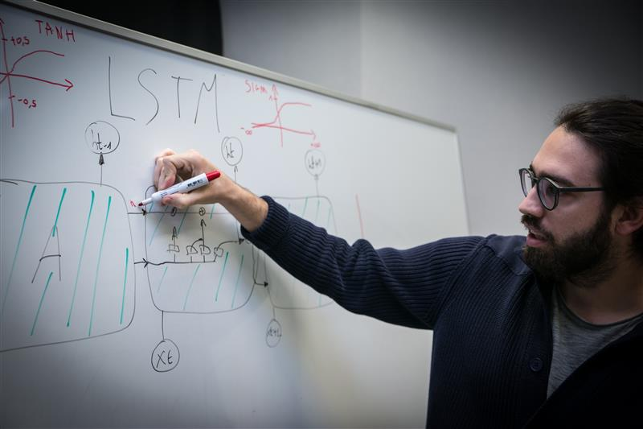
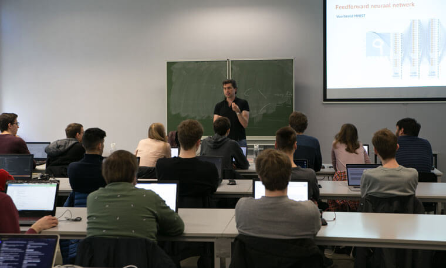

## Een opleiding artificiële intelligentie kiezen. Waar let je op?
Het verkeer slimmer aansturen, kanker sneller opsporen, misdaden oplossen door het verbeteren van lage resolutie beelden en robots aansturen. Supervised learning en neurale netwerken doen jou dromen van het ontwikkelen van AI-software die zelf patronen leert ontdekken, voorspellingen maakt of objecten herkent. Software die net dát beetje slimmer is en nieuwe inzichten vindt in de immer streamende data. Hoe begin je eraan?

## Wat moet je kennen/kunnen?
Artificiële intelligentie-wedstrijden zoals Kaggle geven soms de indruk dat het vooral draait rond het ontwikkelen van neurale netwerken en dat AI voorbehouden is aan mensen die helemaal opgaan in complexe wiskundige en statistische methodes. En inderdaad, veel van de huidige data scientists en AI-experten zijn van oorsprong academici in fysica, statistiek en wiskunde.
Uitstekende frameworks zoals TensorFlow en Keras maakten het ontwikkelen van AI-software veel laagdrempeliger. Meer zelfs, een paar jaar geleden, spendeerden AI-experten makkelijk maanden meer aan NLP (Natural Language Processing) of image recognition modellen. Techgiganten zoals Google ontwikkelden echter voor dat soort toepassingen zeer intuitieve services zoals “Google Dialogflow”. Maw met dit soort services en tools ligt een chatbot of persoonsherkenning app binnen het bereik van iedere goede softwareontwikkelaar.
Naarmate de tijd vordert zal AI-software dus steeds meer het domein worden van ontwikkelaars die voldoende inzicht hebben in AI en zullen de academische AI-experten zich eerder richten op meest complexe AI-projecten waar het begrijpen van de interne werking nog altijd een rol speelt.

Maar een AI-oplossing echt werkende krijgen is veel meer dan statistiek en het tunen en ontwikkelen van een AI-model. Het model moet zich aanpassen aan nieuwe data en moet ook levenslang leren. Daar kan een AI-bachelor de brug maken tussen efficiënte software en complexe AI-modellen. Wie een krachtige datapipeline (batch processing, streaming data) kan ontwerpen en weet hoe je het best je AI-services met nieuwe data voedt en efficiënt software uitrolt is de perfecte collega van de zeer gespecialiseerde AI-Expert. Als het ontwikkelen van AI software meer je ding is dan de zuivere algorithmiek, dan is een AI bachelor iets voor jou. Maar hoe herken je een goede AI Bachelor opleiding?

## Eisen aan een AI-bacheloropleiding
Uit voorgaande is wel duidelijk dat een AI-bachelor meer moet zijn dan een keuzemodule “Machine Learning” of “Neurale netwerken”.  Zonder een basiskennis statistiek en dataverkenning (Module “data science”), dataarchitectuur en opslag (onze modules “Data management” en “Big Data”) kan je met Machine Learning weinig nuttigs doen. Jouw AI-model moet je ook kunnen aanspreken via een backend en goed uitgewerkte API.
Het heeft ook geen zin om het warm water opnieuw uit te vinden. Als Google, Microsoft of Amazon met een superintelligente AI-(cloud)service op de proppen komen, moet je daar maximaal gebruik van maken. Continuous Integration en Continuous Deployment moeten gecombineerd worden met voldoende kennis van hoe AI-software werkt om je plaatsje binnen een AI-dienst of AI-bedrijf te veroveren. 
Toen wij in 2015 begonnen met onze Internet-of-Things-opleiding en een module machine learning en neurale netwerken aanboden merkten we al gauw dat het een mooie stap vooruit is, maar dat dit zeker niet voldoende is anno 2019.  De ervaring die we opdeden met onze eerste generatie Smart Tech & AI-studenten hebben ons toegelaten om ons curriculum steeds verder te perfectioneren, in dialoog met onze studenten MCT en de juiste bedrijven.

Last but not least, zowel jij als je lector moeten echte AI-projecten succesvol afronden. Sinds 2014 voerden verscheidene lectoren en vier onderzoekers 5 jaar ononderbroken onderzoek uit in samenwerking met de industrie. Realworld AI-projecten waren de inspiratie voor onze AI-bachelors “Smart Tech & AI” en “AI Engineer”.

<!-- Figuur: overzicht van een paar videos van AI-projecten (zijn nu gehost op Facebook) -->
En onze MCT-studenten? Die voerden AI-projecten uit voor o.a. Touring Mobilis, TVH, Ordina, RouteYou, Scott Automation en vele anderen. 
Je voert in het vierde semester een project uit samen met de industrie gedurende vijf weken in groep.
In het vijfde semester onderzoek je een topic, door jou gekozen maar in overleg met professionals. De laatste 4 weken van je semester heb je geen les of examens meer en kan je je dus helemaal concentreren op je onderzoek. Dat is ook de reden dat MCT-studenten een hogere kans hebben om echt een stageplaats met AI-opdracht te veroveren.

## MCT “XR Developer” of “AI Engineer”?
Beide zijn gebaseerd op meer dan 5 jaar naarstig onderzoek en 4 jaar ervaring met AI-opleiding. Sommige van onze docenten (o.a. Wouter Gevaert) hebben meer dan 10 jaar AI-ervaring. 
[XR Developer](/programma/#profile-xr-developer) specialiseren zich in de hele IoT ketting van sensors devices tot AI. Zij realiseren projecten in industry 4.0, Smart Cities enz. Zij gaan dieper in op IoT & Robotics, Augmented Reality om Internet-of-things-applicaties tot leven te brengen.

Onze [AI-engineers](/programma/ai-engineer/) zijn softwareontwikkelaars die een complete AI-backend kunnen ontwikkelen. Zij zijn eerder een match voor AI-consultancy en andere IT-dienstverleners en gaan dieper in op cloud services, Continuous Integration en Deployment...
