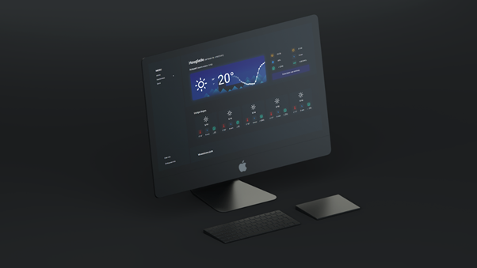

Niels Dewulf, 2MCTer, is één van hen:  
__"Ik heb me eigenlijk van kleins af verdiept in technologie vanaf het 1ste middelbaar kwam ik dan in aanraking met programmeren. Ik maakte Minecraft plugins voor grote servers van YouTubers die 400.000 subscribers hadden.  
Bovendien leerde ik mezelf PHP en de benodigde kennis van Linux voor e-mail servers, web servers, firewalls en databases op te zetten. Voor mijn GIP, een site met database, kreeg ik in 2018 de Febelgra prijs."__

Maar die gedrevenheid maakt daarom Niels’ studiekeuzes niet eenvoudiger:  
__"In het 1ste en 2de middelbaar studeerde ik elektriciteit te VTI Roeselare, ik behaalde zeer goede punten. Maar één ding bleef mij wel bij: het feit dat ik rond het 1ste middelbaar ben beginnen programmeren. Mijn passie lag ergens anders. Ik ging in het 3de naar VTI Brugge waar ik multimedia volgde. Dit was dan ook de richting waar ik in afstudeerde.  
Mijn studiekeuze in hoger onderwijs was ook toen niet in 1-2-3 beslist. Ik heb getwijfeld tussen toegepaste informatica en MCT. De kans om onmiddellijk met cutting-edge technologie te werken in projecten, was doorslaggevend om te kiezen voor MCT."__

> De kans om direct met cutting-edge technologie te werken in projecten, was doorslaggevend om te kiezen voor MCT.

__"Toen ik mij inschreef, lag mijn mijn focus op [Web App developer](https://mct.be/programma/web-app-developer/). Het idee dat ik een Full stack developer kon worden vond ik super. "__

Maar toch besloot Niels een ander pad in te slaan en MCT [“AI Engineer”](https://mct.be/programma/ai-engineer/) te volgen. Wat gaf de doorslag?  
__"Tijdens de lessen Data Science van Wouter Gevaert, die heel goed les geeft, had ik vernomen dat er een nieuwe specialisatie in de maak was, AI Engineer. Dat triggerde mijn passie voor cutting-edge technologie en mijn keuze was gemaakt. Natuurlijk is de passie voor web and app nog steeds niet weg en hou ik mezelf nog up-to-date door zelfstudie."__

Met grote ambitie en veel zelfstudie wordt de opleiding wel getest. Worden ambitieuze studenten nog voldoende uitgedaagd? We laten Niels aan het woord:  
__"Er zijn de vijf MCT Projecten natuurlijk. Maar studenten met veel voorkennis hebben ook de mogelijkheid om uitbreidingen te doen. Bij de module Big Data (door docent/researcher Esli Heyvaert) waren er veel uitbreidingen gelinkt aan de labo’s."__

Die uitbreidingen inspireerde Niels om één van zijn projecten op een technologisch hoger niveau te brengen:  
__"Tijdens mijn carrière in MCT hou ik me bezig met [het digitaliseren van het weerstation van mijn vader]( https://weerstationhooglede.be/). Dit is een side-project en is nog steeds niet af maar is de beste manier om te illustreren wat ik al geleerd heb in MCT."__

Het gebruikt de volgende technologieën:

- Adobe XD (1ste semester)
- Data Science (1ste semester)
- Python (1ste semester)
- Linux (1ste semester)
- Flask (2de semester)
- JS (2de semester)
- HTML & CSS (1ste-3de semester)
- Artificial intelligence (4de semester)
- Time series database (4de semester)
- Docker (semester 3 en 4)

Dit project laat toe om zelf klimatogrammen te maken. Voor Niels is het vooral een website waar hij alles wat hij leert op uitprobeert. 

Zijn passie voor technologie gebruikte Niels ook om een bijdrage te leveren aan de MCT community:  
__"Ik ben owner van de Discord server van de MCT studenten community. Ik leg graag dingen uit aan medestudenten die iets niet snappen."__

Als we hem vragen wat zijn ambities zijn eens hij afgestudeerd is, heeft Niels een paar duidelijke doelen voor ogen.  
__"Mijn doel voor het professionele leven is mensen helpen met mijn werk, hedendaagse problemen oplossen, een job hebben waar ik nooit stop met leren. "__

En ondertussen, is er iets dat we dringend moeten verbeteren in MCT?  
__"Sommige van de AI-Engineers zijn stiekem jaloers op de IoT Infrastructure Engineers, omdat zij een eigen koffiezet hebben."__  
Genoteerd, Niels. Volgend academiejaar beter, dankzij de koffiebar in het nieuwe Howest Penta gebouw!

## Korte Bio:

**Niels Dewulf**  
**Voorkennis**: TSO Multimedia (VTI Brugge)  
**Provincie**: West-Vlaanderen  
**Keuzetraject**: [AI Engineer](https://mct.be/programma/ai-engineer/)  
**Waarom MCT**: De kans om direct met cutting-edge technologie te werken in projecten, was doorslaggevend om te kiezen voor MCT.   

